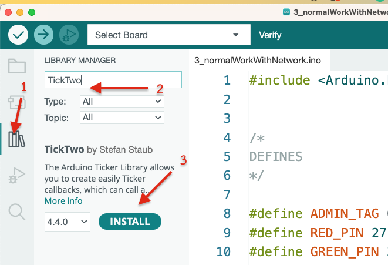
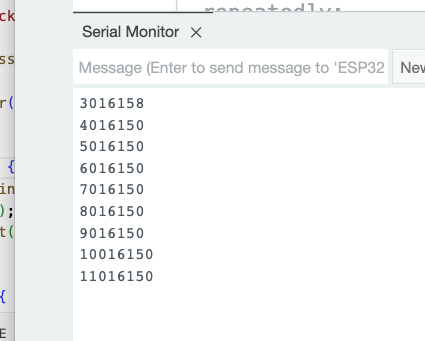
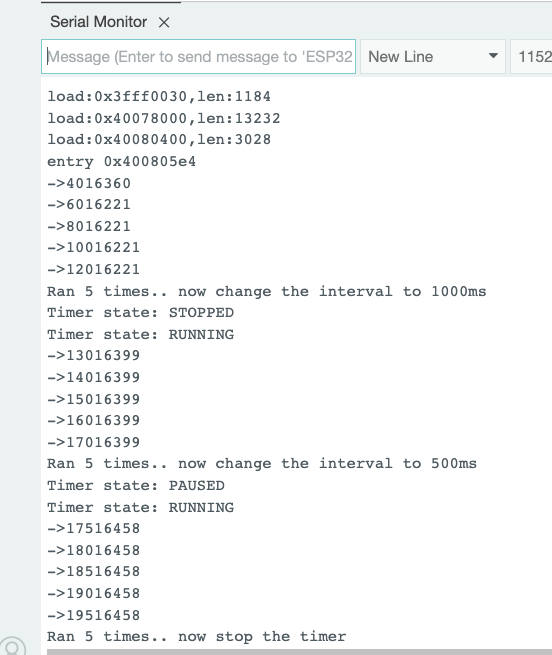

# วิธีการใช้ Library แทนการใช้ millis() ใน Arduino

ในตัวอย่างนี้จะเป็นการใช้ Library ที่ชื่อว่า `TickTwo` แทนการใช้ millis() ใน Arduino โดย Library นี้จะช่วยในการคำนวณเวลาและเรียกฟังก์ชันที่ต้องการให้ทำงานเมื่อถึงเวลาที่กำหนดไว้ โดยไม่ต้องใช้ millis() ในการคำนวณเวลาเอง และไม่ต้องใช้ if ในการตรวจสอบเวลาเอง ทำให้โค้ดสั้นลงและง่ายต่อการเข้าใจ


## 1. การติดตั้ง Library

เข้าไปที่ Library Manager ใน Arduino IDE และค้นหา `TickTwo` และกด Install เพื่อติดตั้ง Library นี้


**ในตัวอย่างนี้จะใช้ ESP32 ในการทดสอบ หากใช้บอร์ดอื่น ๆ เช่น Arduino Uno ให้ใช้ Library Ticker แทน**



## 2. ทำความรู้จักกับ Library

ขั้นตอนการใช้งาน Library มี 4 ขั้นตอนคือ

2.1 กำหนดฟังก์ชันที่ต้องการให้ทำงานเมื่อถึงเวลาที่กำหนดไว้

```cpp
// ไว้เหนือตัวแปร global ก็ได้
void printMessage();


// ไว้ใต้ loop() ก็ได้ 
void printMessage() {
    // ทำงานที่ต้องการทำเมื่อถึงเวลาที่กำหนดไว้
}
```

2.2 สร้าง Object ของ Library

```cpp
TickTwo timer(printMessage, 1000, 0, MICROS);
```
- `printMessage` คือ ฟังก์ชันที่ต้องการให้ทำงานเมื่อถึงเวลาที่กำหนดไว้
- `1000` คือ ระยะเวลาที่ต้องการให้ทำงานฟังก์ชันที่กำหนดไว้ (1000 คือ 1 วินาที)
- `0` คือ จำนวนครั้งที่ต้องการให้ทำงานฟังก์ชันที่กำหนดไว้ ถ้าเป็น 0 จะทำงานตลอดไป
- `MICROS` คือ หน่วยเวลาที่ต้องการให้ทำงานฟังก์ชันที่กำหนดไว้ ในกรณีนี้คือ ไมโครวินาที กรณีใช้เป็น millis ให้ใส่ MILLIS แทน

2.3 สั่งให้ timer ทำงาน

```cpp
//ใส่ไว้ใต้ setup() หรือ loop() ก็ได้
timer.start();
```

2.4 อัพเดท timer เพื่อเช็คเวลาที่กำหนดไว้

```cpp
//ใส่ไว้ใต้ loop() 
timer.update();
```

## 3. ตัวอย่างการใช้งาน

```cpp
#include "TickTwo.h"

void printMessage(); 

TickTwo timer(printMessage, 1000, 0, MICROS);


void setup() { 
  Serial.begin(115200);
  delay(2000);
  timer.start();
}

void loop() {
  timer.update();
}
 
 

void printMessage() {
  Serial.println(micros());
}
```


ผลการทดสอบ


 


## 4. การใช้งานอื่น ๆ

```cpp
//เช็คว่าหลังการรันฟังก์ชันที่กำหนดไว้แล้วผ่านไปเป็นเวลาเท่าไร
timer.elapsed();
```

```cpp
//เช็คว่าอีกกี่มิลลิวินาที หรือไมโครวินาทีจะทำงานฟังก์ชันที่กำหนดไว้
timer.remaining();
```

```cpp
//หยุดการทำงานของ timer
timer.stop();
```

```cpp
//เริ่มการทำงานของ timer อีกครั้ง
timer.resume();
```

```cpp
//เปลี่ยนเวลาที่ต้องการให้ทำงานฟังก์ชันที่กำหนดไว้
timer.interval(500);
```

```cpp
//เช็คจำนวนรอบที่ทำงานไปแล้ว
timer.counter();
```

```cpp
//เช็คสถานะว่า timer ทำงานอยู่หรือไม่
timer.state(); // ค่าจะเป็น STOPPED, RUNNING, PAUSED
``` 

ตัวอย่างการใช้ฟังก์ชันก์ข้างต้นบางส่วน


```cpp
#include "TickTwo.h"

void printMessage(); 

TickTwo timer(printMessage, 2000, 0, MICROS);


void checkStatus() {
  Serial.print("Timer state: ");
  switch(timer.state()) {
    case STOPPED:
      Serial.println("STOPPED");
      break;
    case RUNNING:
      Serial.println("RUNNING");
      break;
    case PAUSED:
      Serial.println("PAUSED");
      break;
  }
}

void setup() { 
  Serial.begin(115200);
  delay(2000);
  timer.start();
}

void loop() {
  timer.update();

  if(timer.counter() >= 5 && timer.interval() == 2000000) {
    Serial.println("Ran 5 times.. now change the interval to 1000ms");
    timer.stop();
    checkStatus();
    timer.interval(1000);
    timer.resume(); //หลัง stop จะนับ counter ใหม่
    checkStatus(); 
  }
  if(timer.counter() >= 5 && timer.interval() == 1000000) {
    Serial.println("Ran 5 times.. now change the interval to 500ms");
    timer.pause();
    checkStatus();
    timer.interval(500);
    timer.resume(); //หลัง pause จะไม่นับ counter ใหม่ 
    checkStatus();
  }
  if(timer.counter() >= 10 && timer.interval() == 500000) {
    Serial.println("Ran 5 times.. now stop the timer");
    timer.stop();
  }
}
 
 

void printMessage() {
  Serial.print("->");
  Serial.println(micros());
}
  
```


หวังว่าจะมีประโยชน์สำหรับคนมองหาไลบรารี่ที่ช่วยอำนวยความสะดวกในการเรียกใช้ millis() หรือ micros() กันนะครับ 